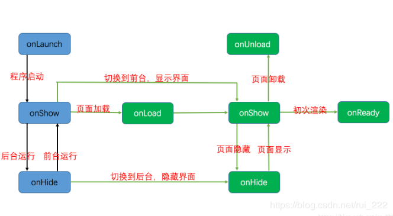

生命周期
===================

###  注册
**注册小程序**
每个小程序都需要在 app.js 中调用 App 方法注册小程序示例，绑定生命周期回调函数、错误监听和页面不存在监听函数等。

    // app.js
    App({
      onLaunch (options) {
        // Do something initial when launch.
      },
      onShow (options) {
        // Do something when show.
      },
      onHide () {
        // Do something when hide.
      },
      globalData: 'I am global data'
    })

开发者可以通过 getApp 方法获取到全局唯一的，共享的 App 示例，获取App上的数据或调用开发者注册在 App 上的函数。

    // xxx.js
    const appInstance = getApp()
    console.log(appInstance.globalData) // I am global data
**注册页面**
对于小程序中的每个页面，都需要在页面对应的 js 文件中调用 Page 方法注册页面示例，指定页面的初始数据、生命周期回调、事件处理函数等。

###  生命周期
**应用生命周期**
onLaunch()
小程序初始化完成时触发，全局只触发一次。参数也可以使用 wx.getLaunchOptionsSync 获取。

onShow()
小程序启动，或从后台进入前台显示时触发。也可以使用 wx.onAppShow 绑定监听。

onHide()
小程序从前台进入后台时触发。也可以使用 wx.onAppHide 绑定监听。

onError(String error)
小程序发生脚本错误或 API 调用报错时触发。也可以使用 wx.onError 绑定监听。
**页面生命周期**
onLoad() 
监听页面加载，只触发一次。

onShow() 
监听页面显示

onReady()
监听页面初次渲染完成，只触发一次。

onHide()
监听页面隐藏

onUnload()
监听页面卸载

