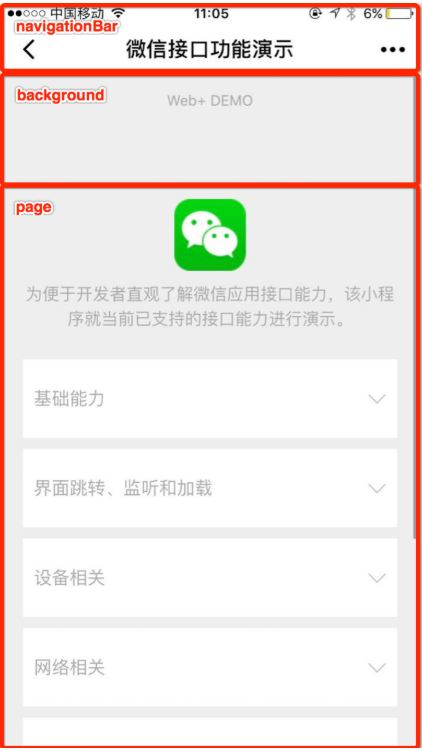
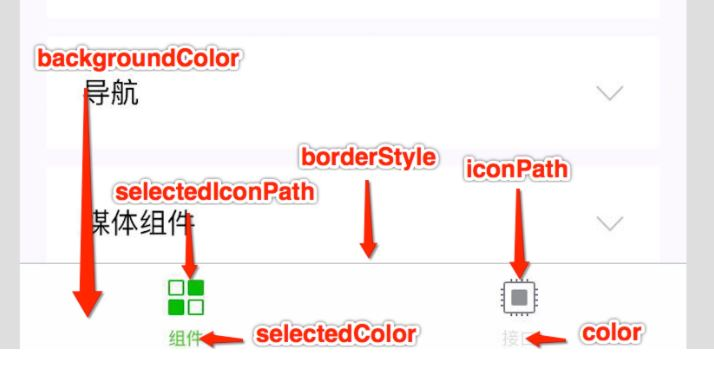

配置文件
===================

###全局配置
根目录下的 `app.json` 文件用来对微信小程序进行全局配置，常见配置项包括：

1.`pages`（必填）	
放置小程序页面路径列表，为字符串数组(`[str,str.....]`)。文件名不需要写文件后缀，框架会自动去寻找对于位置的 .json, .js, .wxml, .wxss 四个文件进行处理。
也可以在这里新建页面，页面的放置顺序对应着小程序打开的页面顺序。
例如初始界面为：

    ├── app.js
    ├── app.json
    ├── app.wxss
    ├── pages
    │   │── index
    │   │   ├── index.wxml
    │   │   ├── index.js
    │   │   ├── index.json
    │   │   └── index.wxss
    │   └── logs
    │       ├── logs.wxml
    │       └── logs.js
    └── utils
则page就为：

    "pages": ["pages/index/index", "pages/logs/logs"]

2.`window`
设置小程序整体的状态栏、导航条、标题、窗口背景色。

还有一些重要属性：

    enablePullDownRefresh	boolean	false	是否开启全局的下拉刷新。
    
    onReachBottomDistance	number	50	页面上拉触底事件触发时距页面底部距离，单位为 px。
    
    pageOrientation	string	portrait	屏幕旋转设置，支持 auto / portrait / landscape 

3.**tabBar**
设置 tab 栏切换页面

重要属性：

1.`list`（必要）	
放置数组对象（`[{},{},{},{},{},{}]`）		
tab 的列表，最少 2 个、最多 5 个 tab。

    "list": [{
      "pagePath": "pagePath",
      "text": "text",
      "iconPath": "iconPath",
      "selectedIconPath": "selectedIconPath"
    }]
pagePath直接粘贴pages中设置的路径即可。icon要小于40kb，建议尺寸为 81px * 81px。

2.`custom`	
boolean，默认否（false），可以在这里自定义 tabBar。

4.**debug**
可以在开发者工具中开启 debug 模式，默认为fales。

###页面配置
每一个小程序页面也可以使用 .json 文件来对本页面的窗口表现进行配置，所以无需写 window 这个属性，就直接写页面的配置。页面中配置项在当前页面会覆盖 app.json 的 window 中相同的配置项。

###sitemap 配置
根目录下的 sitemap.json 文件用于配置小程序及其页面是否允许被微信索引，文件内容为一个 JSON 对象，如果没有 sitemap.json ，则默认为所有页面都允许被索引。