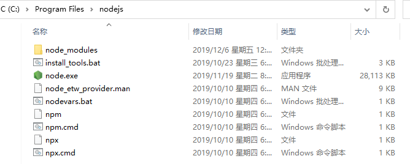

CommonJS模块规范
===
CommonJS 是一种模块规范，规定每个JS文件就是一个模块，有自己的作用域。模块的变量、函数、类，都是私有的，对其他文件不可见。


###  module变量
每个模块内部，module变量代表当前模块。这个变量是一个对象，它的exports属性（即module.exports）是对外的接口。这个接口是一个空对象，给这个对象的值就是模块要暴露的内容，加载某个模块，其实是加载module.exports对象。
```
Module {
  id: '<repl>',
  path: '.',
  exports: {},
  parent: undefined,
  filename: null,
  loaded: false,
  children: [],
  paths: [
    'E:\\myTest\\repl\\node_modules',
    'E:\\myTest\\node_modules',
    'E:\\node_modules',
    'C:\\Users\\Administrator\\.node_modules',
    'C:\\Users\\Administrator\\.node_libraries',
    'C:\\Program Files\\nodejs\\lib\\node'
  ]
}
```
模块所引用的其他模块的信息，会push到module.children内，被引用则保存在module.parent。利用这一点，可以判断当前模块是否为入口脚本，因为入口文件会引用其他模块，不会被引用，所以入口文件的module.parent为undefined。

###  require方法
``require()``接受一个模块的路径作为参数，加载该模块module.exports的内容。
```
var example = require('./example.js');
```
根据参数的不同格式，require命令去不同路径寻找模块文件。
1.如果参数字符串以``/``开头，则表示加载的是一个位于绝对路径的模块文件。
2.如果参数字符串以``./``开头，则表示加载的是一个位于相对路径的模块文件。
3.如果参数字符串不以``./``或``/``开头，则表示加载的是一个node提供的核心模块，或者一个位于node_modules目录的已安装模块。
node_modules是NodeJS定义的目录，专门用于存放模块。

