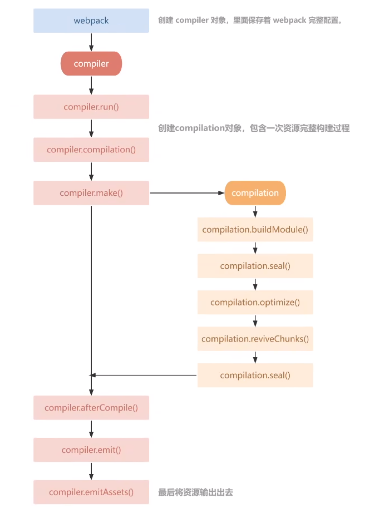

核心概念
===================
webpack 需要建立一个 webpack.config.js 配置文件，文件遵循 CommonJS 模块规范，使用 require(...) 引入其他文件。文件内导出了一个 webpack 配置的对象。

###  入口(entry)
入口起点(entry point)指示 webpack 应该使用哪个模块，来作为构建其内部依赖的开始，webpack会根据这个文件来查找需要的依赖。

    module.exports = {
      entry: './src/index.js' //入口
    };

###  输出(output)
output 属性告诉 webpack 在哪里输出它所创建的 bundles，以及如何命名这些文件。

    const path = require('path');  // node模块

    module.exports = {
      entry: './src/index.js',
      output: {                                 // 输出
        path: path.resolve(__dirname, 'dist'),  // 文件输出路径
        filename: '[name].js',                  // 文件名
        publicPath: './'                        // html文件内src的路径
      }
    };

###  loader
webpack 自身只理解js和json（webpack1.0版本不支持），loader 可以将其他类型的文件转换为 webpack 能够处理的模块。
不同类型的文件使用不同的loader，需要先用npm下载安装loader。再将配置信息写在 module.rules。

    module: {
      rules: [
        { test: /\.txt$/, use: 'raw-loader' },
        { test: /\.css$/, use: ['style-loader', 'css-loader'] }, //cssloader负责加载css文件，styleloader负责样式添加到dom
        { test: /\.ts$/, use: 'ts-loader' },
      ]
    }

loader 有两个属性：
1.test：识别出哪些文件会被转换。
2.use：定义出在进行转换时，应该使用哪个 loader。
一种文件类型使用多个loader时，顺序是从后往前使用，上一个 loader 转换后的资源传递给下一个 loader。因此css必须先调用cssloader，再调用styleloader。

loader是函数，当webpack解析资源时，会调用相应的loader去处理。函数接收三个参数：
1.content：文件内容
2.map：sourcemap
3.meta：别的loader传递的数据

###  插件(plugins)
插件用于执行具体的任务。包括：打包优化，资源管理，注入环境变量。需要先用npm下载安装plugin。
想要使用一个插件，需要 require() 它，插件是class（构造函数），需要new实例化后，添加到 plugins 数组中。

    plugins: [
      new plugins1(),
      new plugins2(参数),
    ]

webpack在编译过程中，会创建compiler对象，顺序触发一系列钩子事件。插件可以注册在compiler的钩子内，在钩子执行时被调用。

**compiler**
webpack读取配置文件，生成compiler对象并遍历所有插件。compiler是webpack执行的全局上下文，compiler对象创建后会调用插件的apply方法，apply接收compiler对象作为参数。

**compilation**
是一次资源编译的上下文。

