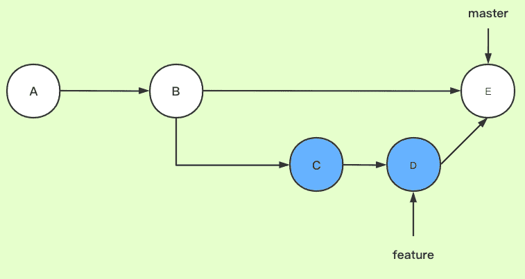
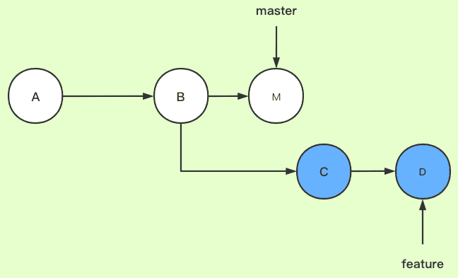
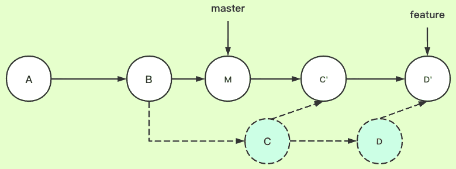

分支管理
===================
使用分支意味着可以从开发主线上分离开来，然后在不影响主线的同时继续工作。

    git branch //查看本地所有分支 
    git branch -r //查看远程所有分支

###  新分支
创建分支命令：

    git branch (branchname)

切换分支命令:

    git checkout (branchname)
也可以`$ git checkout -b (branchname)`表示创建并切换分支。
切换分支的时候，Git 会用该分支的最后提交替换工作目录的内容， 所以多个分支不需要多个目录。
`git merge`命令用于合并指定分支到当前分支，也就是说，需要先需要checkout到主分支（master）再来合并其他分支的内容到主分支。

    $ git chackout master
    $ git merge (branchname)

合并完成后，就可以删除分支了：

    $ git branch -d (branchname)
如果要丢弃一个没有被合并过的分支，可以通过`git branch -D (branchname)`强行删除。
注意，对于所有分支而言， 工作区和暂存区是**公共的**。也就是说，没有commit到具体分支的文件是所有分支共享的。只有commit之后的文件才是具体分支特有的。

###  分支冲突
主分支和新分支如果分别修改了同一个文件的相同位置，在提交之后，两个分支的本地库将会无法合并，也就是两个分支产生分支冲突。因为Git无法判读使用哪个分支的本地库。

    $ git merge (branchname)
    Auto-merging gittest.txt
    CONFLICT (content): Merge conflict in gittest.txt
    Automatic merge failed; fix conflicts and then commit the result.
在本地打开文件，就可以看到Git用<<<<<<<，=======，>>>>>>>标记出不同分支的内容冲突产生的位置，此时，需要手动对文件更改，修改完成后再次进行提交。

###  合并策略
#### merge
merge是合并一个分支到当前分支。

Git会用Fast forward模式，但这种模式下，删除分支后，会丢掉分支信息。

如果禁用Fast forward模式，Git就会在merge时生成一个新的commit，这样，从分支历史上就可以看出分支信息。

    $ git merge --no-ff -m "merge with no-ff" (branchname)
`--no-ff`参数，表示禁用Fast forward，而且本次合并要创建一个新的commit，所以加上-m参数，把commit描述写进去。这样合并后，可以用git log看到分支历史。

#### rebase
rebase是将当前分支改为以另一个分支为起点。

git checkout feature
git rebase master
以master为起点，合并feature分支。可以简写为git reabse master feature

此时，基分支（master 分支）的 HEAD 指针依然在之前的 commit （576cb7b）处，还需要将 feature 分支合入到 master 分支上
git checkout master
git merge feature
这样的提交记录，就像是一直在master分支开发一样。

在实际开发中，应该按照几个基本原则进行分支管理：
首先，master分支应该是非常稳定的，也就是仅用来发布新版本，平时不能在上面干活，干活都在其他分支上。
因此，直到发布新版本时，再把其他分支合并到master上，在master分支发布新版本。
合并分支时，加上--no-ff参数就可以用普通模式合并，合并后可以查看合并历史，能看出来曾经做过合并，而fast forward合并就看不出来曾经做过合并。