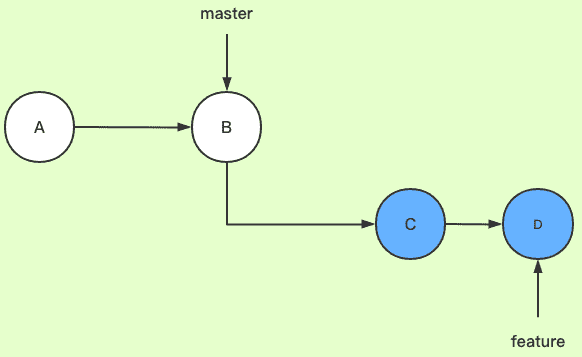

分支管理
===================
多人开发时，使用分支可以避免互相影响。

    git branch //查看本地所有分支 
    git branch -r //查看远程所有分支

###  新分支
创建分支命令：

    git branch 分支名称

切换分支命令:

    git checkout 分支名称
也可以`git checkout -b 分支名称`表示创建并切换分支。

`git merge`命令用于合并一个分支到当前分支，也就是说，需要先需要checkout到主分支（master）再来合并其他分支的内容到主分支。

    git chackout master
    git merge 分支名称

合并完成后，就可以删除分支了：

    git branch -d 分支名称
如果要丢弃一个没有被合并过的分支，可以通过`git branch -D 分支名称`强行删除。
注意，对于所有分支而言， 工作区和暂存区是**公共的**。也就是说，没有commit到具体分支的文件是所有分支共享的。只有commit之后的文件才是具体分支特有的。

###  分支冲突
主分支和新分支如果分别修改了同一个文件的相同位置，在提交之后，两个分支的本地库将会无法合并，也就是两个分支产生分支冲突。因为Git无法判读使用哪个分支的本地库。

    git merge 分支名称
    Auto-merging gittest.txt
    CONFLICT (content): Merge conflict in gittest.txt
    Automatic merge failed; fix conflicts and then commit the result.
在本地打开文件，就可以看到Git用<<<<<<<，=======，>>>>>>>标记出不同分支的内容冲突产生的位置，此时，需要手动对文件更改，修改完成后再次进行提交。

###  合并策略
#### merge
merge是合并一个分支到当前分支。

Git默认Fast forward模式，但这种模式下，删除分支后，会丢掉分支信息。

如果禁用Fast forward模式，Git就会在merge时生成一个新的commit，这样，从分支历史上就可以看出分支信息。

    git merge --no-ff -m "merge with no-ff" 分支名称
`--no-ff`参数，表示禁用Fast forward，而且本次合并要创建一个新的commit，所以加上-m参数，把commit描述写进去。这样合并后，可以用git log看到分支历史。


#### rebase
rebase是将当前分支改为以另一个分支为起点。

```
git checkout feature
git rebase master
```
将feature分支变基到master。可以简写为git rebase master feature


此时，基分支（master 分支）的 HEAD 指针依然在之前的 commit 处，还需要将 feature 分支合入到 master 分支上
```
git checkout master
git merge feature
```
提交记录，就像是一直在master分支开发一样。